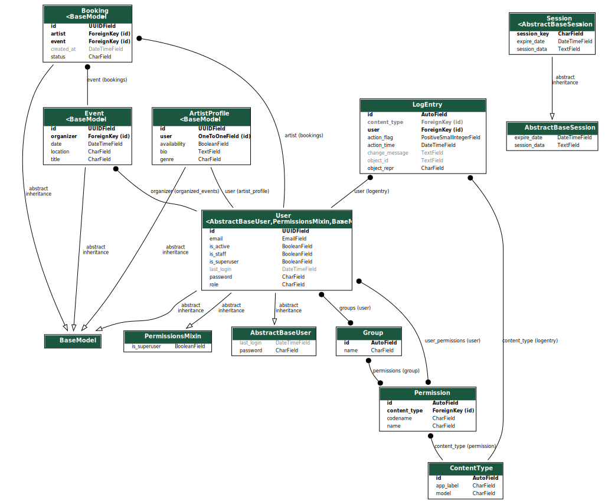

# 🎵 Music Booking API

A RESTful API for managing artist profiles, event listings, and booking transactions.

## 🚀 Features

- **Artist Profiles** : Create and manage artists with availability status.
- **Event Listings** : Organizers can list events with date, location, and details.
- **Booking Transactions** : Organizers can book artists for events.
- **Authentication** : Secure access for users (organizers & artists).

## 🛠️ Tech Stack

- **Backend** : Django, Django REST Framework
- **Database** : SQLite (can be switched to PostgreSQL)
- **Authentication** : Django User Model
- **API Docs** : Postman Collection

## 📂 Project Setup

### 1️⃣ Clone the Repository

```bash
git clone https://github.com/Obcodelab/music-booking-api.git
cd music-booking-api
```

### 2️⃣ Create a Virtual Environment

```bash
 # For macOS/Linux
python3 -m venv venv
source venv/bin/activate
```

```bash
# For Windows
python -m venv venv
venv\Scripts\activate
```

### 3️⃣ Install Dependencies

```bash
pip install -r requirements.txt
```

### 4️⃣ Create .env file

```bash
touch .env
# Create a SECRET_KEY variable
```

### 5️⃣ Apply Database Migrations

```bash
python manage.py migrate
```

### 6️⃣ Create a Superuser (for Admin Panel)

```bash
python manage.py createsuperuser
# Follow the prompts to set up a username and password.
```

### 7️⃣ Run the Development Server

```bash
python manage.py runserver
# Now visit http://127.0.0.1:8000/admin/ to access the Django Admin Panel.
```

## 📌 API Endpoints

Visit http://127.0.0.1:8000/redoc/ to see api endpoints

## 📜 Database Schema



## 🧪 API Testing (Postman Collection)

- Open Postman.
- Import the music-booking-api.postman_collection.json file.
- Use the provided requests to test the API.

## 📜 License

This project is open-source under the MIT License.
